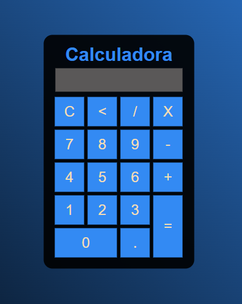

<h1 align="center"> Calculadora Simples </h1>

Projeto simples para aperfeiçoar a aprendizagem

  

 

## Tecnologias

Esse projeto foi desenvolvido com as seguintes tecnologias :

- HTML
- CSS
- JavaScript
